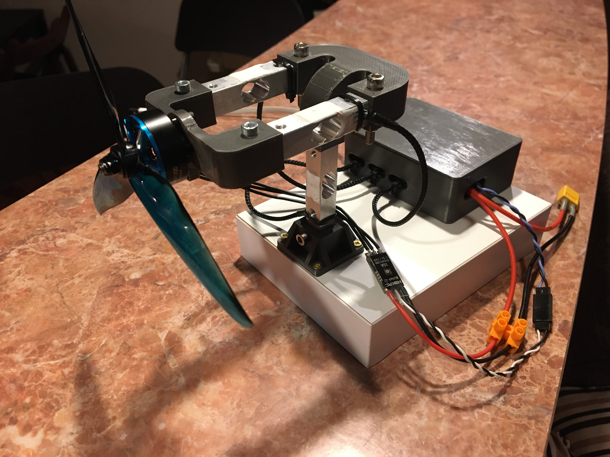

# PropDyno

Micro UAV propeller meter

Features:
- thrust and torque readings
- voltage and amps readings
- step response analysis
- arduino nano based pcb
- using 3 load cells (12.7x12.7x80 up to 5 kg)
- HX711 modules with 80 Hz update rate
- external current meter and voltage divider
- PCB and STLs included

# Example readings

# Prototype

